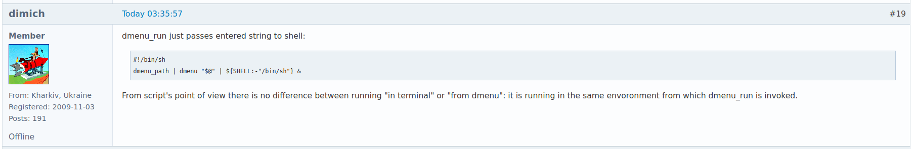

# Difference between running a script "in terminal" and "from dmenu"

2023-04-12 Wednesday 11:26 11:26:16 AM

Most linux users have their owned scripts in somewhere `$PATH` like in `~/.local/bin`.
I have many too. Later, I became concerned if I run a script accidentally from `dmenu` or `bemenu`
that I intend to run it in a terminal interactively. For example, lets say I have the following script in `$PATH`.

```bash
#!/bin/bash
read -p "type input: " inp
echo "$inp"
```

Everybody knows what if the script is executed in a terminal, it will prompt and wait for user's input
and echo will print it out. But if I accidentally executed it from `dmenu` or `bemenu`,
the script will be running and waiting user's input in background. To check if it is running background,
run `$ pgrep -f scriptname`. It will show a process id number. Yes, you can kill it by `$ kill -9 <ps_number>`.
But it is not good practice. So, the question in this case is that how to make a script to run only inside terminal
and avoid running background or being executed from `dmenu` or `bemenu`.

In that case, many people tend to mention `tty -s || exit 1` but it doesn't work.

> From script's point of view there is no difference between running "in terminal" or "from dmenu":
> it is running in the same envoronment from which dmenu_run is invoked.



The valuable text quoted above is form the link @ [how to make a script to run only in terminal?](https://bbs.archlinux.org/viewtopic.php?id=284933).
Thanks to the valuable knowledge from ___dimich___ @ [Arch Linux Forum](https://bbs.archlinux.org), I was able to learn one thing.
If `dmenu` is run by the way as mentioned the forum by ___dimich___ at the reply number __#19__, `tty -s || exit 1` would work as we expected.

But running dmenu everytime with the way like `$ dmenu_path | dmenu "$@" | ${SHELL:-"/bin/sh"} &` is not very preferrable.
So, the workaround mentioned at the reply number __#2__ should be considered and look at the reply posts of __#4__ and __#12__.

For example, a script that can setup [eCryptfs](https://wiki.archlinux.org/title/ECryptfs) interactively in terminal should avoid being executed from `dmenu` or `bemenu`.
The example script is below.

```bash
#!/bin/bash

read -e -t 3 -i "Yes" -p "say Yes in 3 sec: " yescontinue
[ -z "$yescontinue" ] && notify-send -t 3000 "the script has been closed" "for no user input" && exit 0
echo "continue..."
echo "$yescontinue" > /dev/null

if [[ "$1" == "--prvdir" && ! -z "$2" ]]; then
    echo "private directory name was given..."
else
    notify-send -t 3000 "the script has been closed" "private directory was not given"
    exit 0
fi

if lsmod | grep -wq "^ecryptfs"; then
    echo "module was loaded..."
else
    echo "load ecryptfs kernel module first"
    echo "run # modprobe ecryptfs"
    exit 0
fi

if which ecryptfs-wrap-passphrase > /dev/null 2>&1; then
    echo "commands are available..."
else
    echo "commands are not available"
    echo "install <ecryptfs-utils> package"
    exit 0
fi

mkdir -p $HOME/.myprivatedata
prvd=$HOME/.myprivatedata/"$2"
prvs=$HOME/.myprivatedata/."$2"

if df -T | grep -wq "$prvd"; then
    echo "already mounted, check first"
    exit 0
fi

if [ -d "$prvd" ]; then
    echo ""$prvd" exits, check first"
    exit 0
fi
if [ -d "$prvs" ]; then
    echo ""$prvs" exits, check first"
    exit 0
fi

mkdir -p "$prvd" "$prvs"

mkdir -p ~/.ecryptfs
wppf=~/.ecryptfs/"$2".wp
conf=~/.ecryptfs/"$2".conf
sigf=~/.ecryptfs/"$2".sig

if [[ -f "$wppf" && -f "$conf" && -f "$sigf" ]]; then
    echo "all config files exit, trying mount first..."
    echo "if it didn't work, delete all config files or change private directory name, and rerun this script"
    mount.ecryptfs_private "$2"
    exit 0
else
    echo "continue for creating config files..."
fi

ecryptfs-wrap-passphrase ~/.ecryptfs/"$2".wp
echo "Passphrase has been wrapped into ~/.ecryptfs/"$2".wp file."

echo "$prvs" "$prvd" ecryptfs > ~/.ecryptfs/"$2".conf
( stty -echo; printf "Passphrase: " 1>&2; read PASSWORD; stty echo; echo $PASSWORD; ) | \
    ecryptfs-insert-wrapped-passphrase-into-keyring ~/.ecryptfs/"$2".wp - > /tmp/ecryptfs-insert-key

sigkey=$(cat /tmp/ecryptfs-insert-key | awk -F '[][]' '/Inserted auth tok with sig/ {print $2}')
echo "$sigkey" > ~/.ecryptfs/"$2".sig
echo "$sigkey" >> ~/.ecryptfs/"$2".sig
echo "config files have been created successfully and trying to mount..."

mount.ecryptfs_private "$2"
rm /tmp/ecryptfs-insert-key
df -T | grep "$prvd"
```
