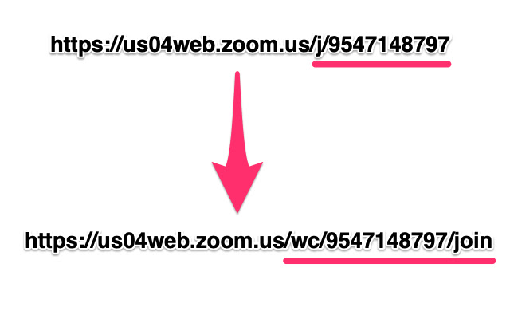

# Zoom link redirector

2023-03-12 Sunday 18:58 06:58:29 PM

If a zoom line is open in browser, it force to launch `zoom` application.
It is annoying. To join a zoom meeting in browser, the zoom link need to be adjusted. For example, change  
`https://us04web.zoom.us/j/9547148797` to  
`https://us04web.zoom.us/wc/9547148797/join`

see: photo

---

